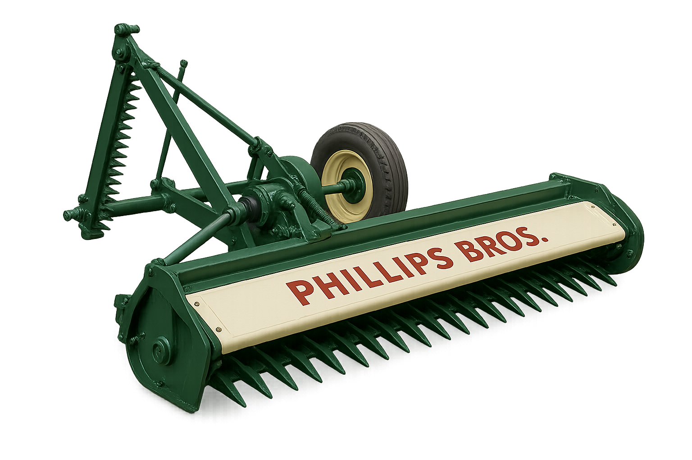
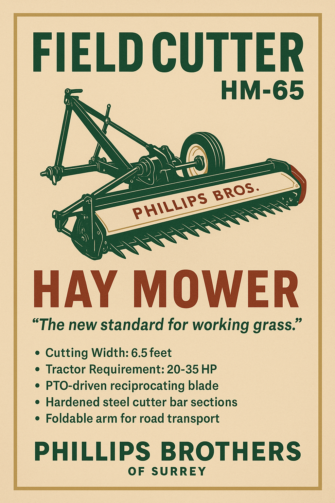

# HM-65 “FieldCutter” Hay Mower

> Product description

- Line: [Hermitage Works](../README.md#hermitage-line---traditional-craftsmanship-heritage-performance)
- Release Year: 1955
- Working Width: 6.5 feet (2 m)
- Tractor Requirement: 20 HP 
- Weight: Approx. 340 kg
- Speed: 5 mph

## Operator’s Manual (Extract) – 1953 Edition
