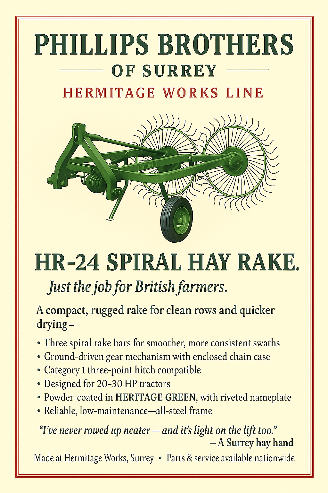

# HR-5 “FieldMate” Spiral Hay Rake

> Product description

- Line: [Hermitage Works](../README.md#hermitage-line---traditional-craftsmanship-heritage-performance)
- Release Year: 1954
- Working Width: 5ft (1.52 m)
- Tractor Requirement: 20 HP 
- Weight: Approx. 310 kg
- Speed: 4 mph

## Operator’s Manual (Extract)
