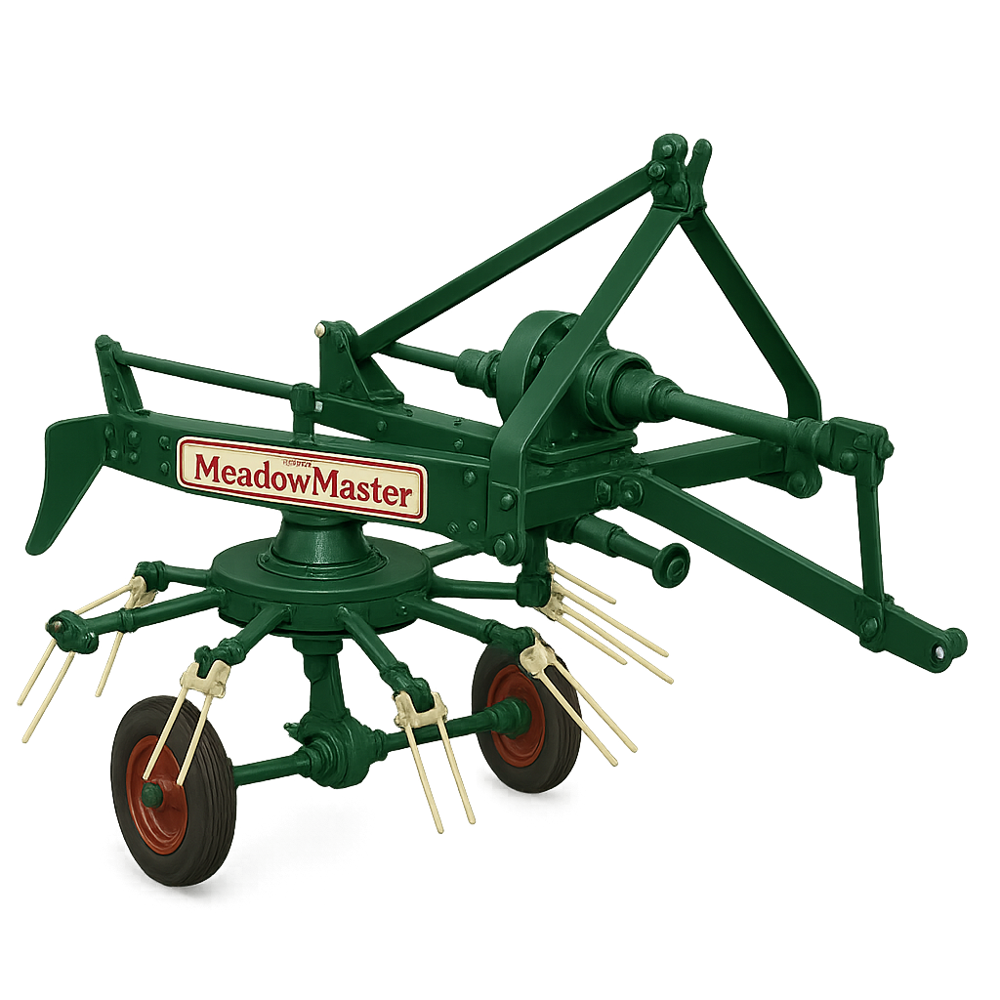

# HT5 “MeadowMaster” Hay Turner (Tedder)

> "Harness the power of the sun with the 1953 MeadowMaster — the latest innovation from Phillips Brothers of Surrey. Finished in our enduring Heritage Green with cream detail and oxide red decals, it’s a machine that looks as sharp as it works. Whether clover or rye, let the MeadowMaster lift, turn, and dry with gentle strength. Built at Hermitage Works — built to last."

- Line: [Hermitage Works](../README.md#hermitage-line---traditional-craftsmanship-heritage-performance)
- Release Year: 1953
- Working Width: 5 feet (1.52 m)
- Tractor Requirement: 20–30 HP (Category I three-point hitch)
- Weight: Approx. 320 kg
- Speed: 4 mph

## Operator’s Manual (Extract) – 1953 Edition

### Section II – Daily Operation
2.1 – Attaching to Tractor
Ensure the tractor engine is off and the brakes fully engaged. The MeadowMaster is designed for use with a Category I three-point hitch. Back the tractor squarely and align the lift arms with the implement’s hitch lugs. Secure all pins with appropriate linchpins. Connect the PTO shaft, ensuring all guards are in place.

> ⚠ Caution: Never operate the MeadowMaster without all PTO guards and shaft covers in position.

2.2 – Field Preparation and Settings
Inspect the field for large stones or obstacles before entering with the implement. Adjust the swath-control vanes using the side lever to ensure an even spread of hay. For heavier crops, widen the vane angle slightly to improve aeration.

2.3 – Operating Speed
Maintain a ground speed of no more than 4 mph in the field. Excessive speed may cause tine damage or uneven hay distribution. For optimal results, overlap passes by 15% to ensure uniform coverage.

2.4 – Maintenance Before Use
Before each day’s use, apply grease to the following points:
- Rotor spindle (x1)

- PTO shaft knuckles (x2)

- Drive chain tensioner (x1)

- Wheel hubs (x2)

Check all tines for damage or looseness. Replace any broken tines with genuine Phillips Brothers replacements only.

### Section III – Storage and Preservation

3.1 – After Use
After operation, clean the MeadowMaster thoroughly with a brush and rag. Avoid high-pressure water sprays, which may displace lubricants. Apply a light coating of oil to all exposed iron parts before storage.

3.2 – Winter Storage
Store indoors where possible. If left outside, raise on blocks to prevent tyre flatting and cover with tarpaulin, ensuring ventilation to avoid condensation.

> Built at Hermitage Works for the working British farm. Trust in the name — Phillips Brothers of Surrey.
