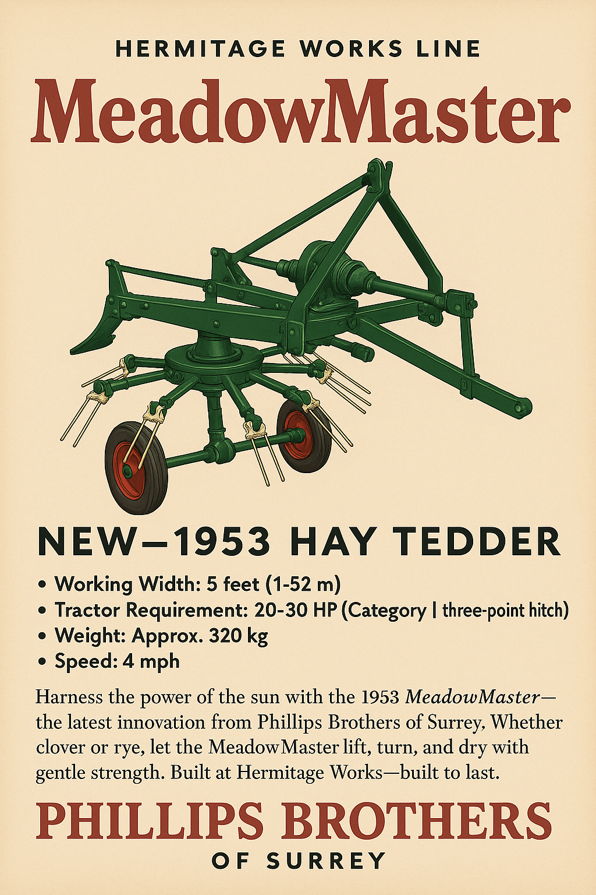

# HT5 “MeadowMaster” Hay Turner (Tedder)

> "Harness the power of the sun with the 1953 MeadowMaster — the latest innovation from Phillips Brothers of Surrey. Finished in our enduring Heritage Green with cream detail and oxide red decals, it’s a machine that looks as sharp as it works. Whether clover or rye, let the MeadowMaster lift, turn, and dry with gentle strength. Built at Hermitage Works — built to last."

- Line: [Hermitage Works](../README.md#hermitage-line---traditional-craftsmanship-heritage-performance)
- Release Year: 1953
- Working Width: 5 feet (1.52 m)
- Tractor Requirement: 20–30 HP (Category I three-point hitch)
- Weight: Approx. 320 kg
- Speed: 4 mph

## Operator’s Manual (Extract) – 1953 Edition

### Section II – Daily Operation
2.1 – Attaching to Tractor
Ensure the tractor engine is off and the brakes fully engaged. The MeadowMaster is designed for use with a Category I three-point hitch. Back the tractor squarely and align the lift arms with the implement’s hitch lugs. Secure all pins with appropriate linchpins. Connect the PTO shaft, ensuring all guards are in place.

⚠ Caution: Never operate the MeadowMaster without all PTO guards and shaft covers in position.
