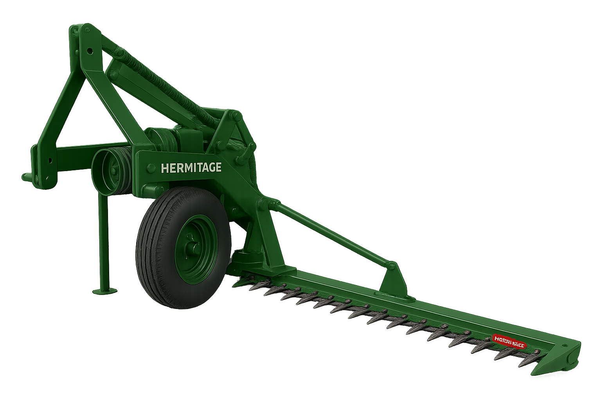
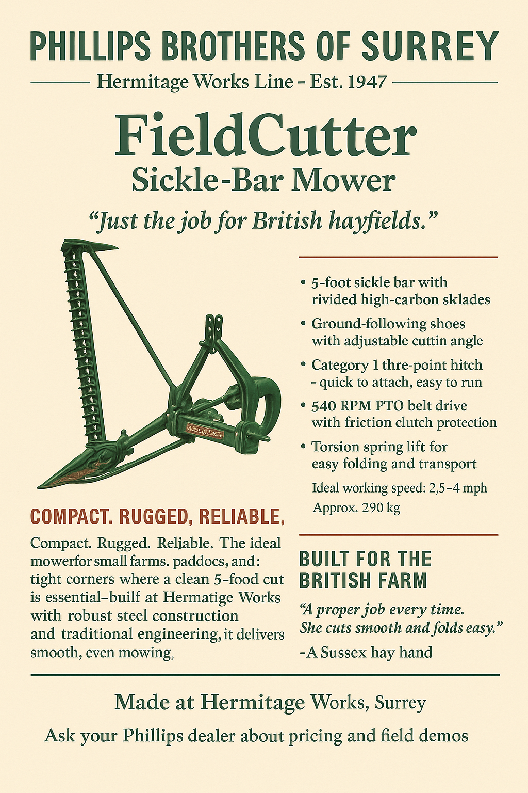

# HM-65 “FieldCutter” Hay Mower

> Product description

- Line: [Hermitage Works](../README.md#hermitage-line---traditional-craftsmanship-heritage-performance)
- Release Year: 1955
- Working Width: 6.5 feet (2 m)
- Tractor Requirement: 20 HP 
- Weight: Approx. 340 kg
- Speed: 5 mph

## Operator’s Manual (Extract) – 1955 Edition

### SECTION 3 — Operation & Field Use

3.1 Hitching to Tractor
Ensure the tractor is fitted with a Category I three-point linkage and a functioning rear PTO (540 RPM). Position the FieldCutter so that the lift arms align easily with the lower pins. Fit and secure both arms, then attach the top link to the adjustable tower bracket. Check that the cutter bar clears the ground evenly when raised.

3.2 Engaging the Mower
Start the tractor engine at low idle and engage the PTO shaft. The FieldCutter uses a belt-driven pulley system to operate the reciprocating knife. Ensure the belt is taut and turns freely before increasing RPM. Operate at a steady 2.5 to 4 mph depending on crop density and terrain. Do not exceed recommended speed, as this may cause clogging or incomplete cutting.

3.3 Field Technique
Enter the field with the bar fully extended and level. The bar should run parallel to the ground, skimming just above soil level. Always mow clockwise around the field so cut material falls away from the next pass. For best results, mow in dry conditions and avoid reversing while the PTO is engaged. The outer shoe should ride cleanly on the ground, guided by the adjustable skid.

3.4 Stopping & Folding
To halt mowing, disengage the PTO and idle the engine. Lift the implement using the tractor hydraulics and engage the bar lock to rotate the cutter vertically into transport position. Use care when folding to avoid strain on the torsion spring or belt assembly.

### Maintenance Notes
Lubricate knife pivot points every 5 hours

Tension drive belt weekly using the adjustment bolt

Inspect shoes and ledger plates for wear or obstruction

Clean off all crop material before storage
