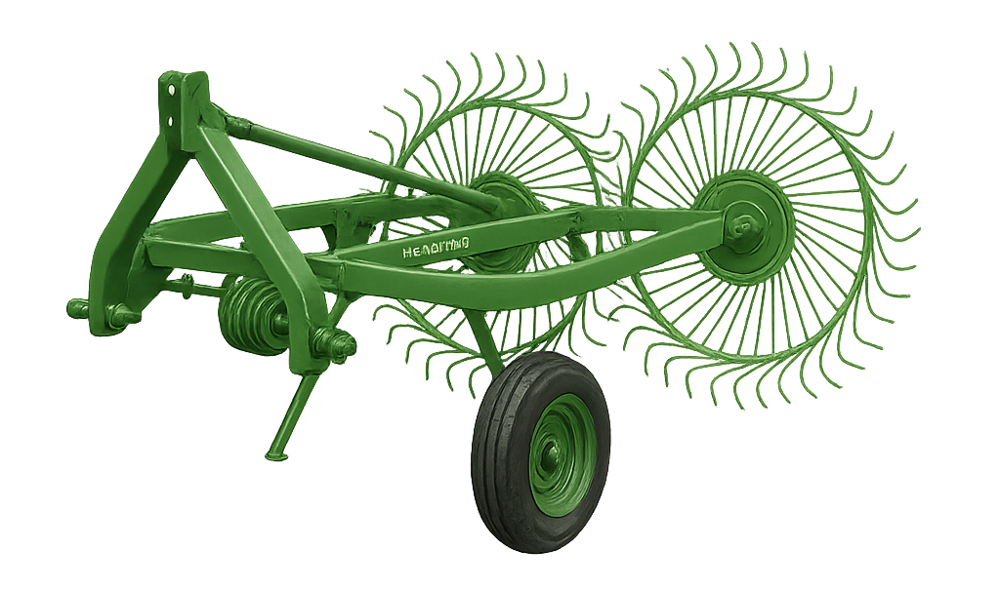
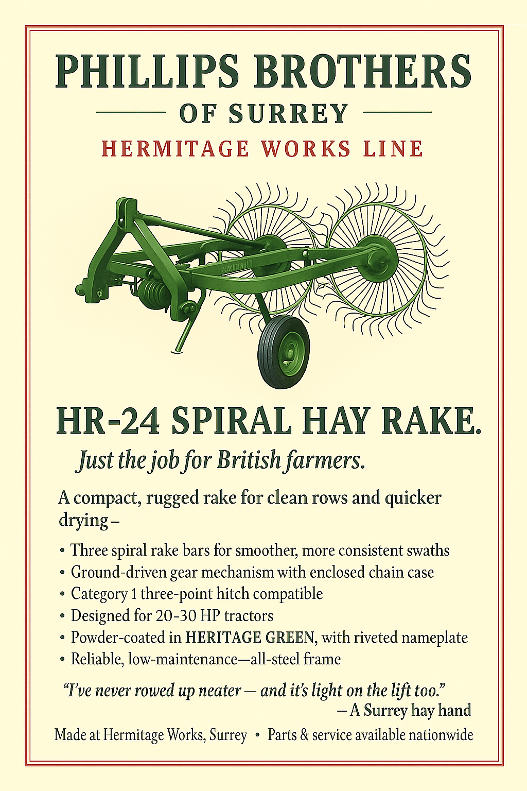

# HR-5 “FieldMate” Spiral Hay Rake (Windrower)

> The HR-5 “FieldMate” Spiral Hay Rake from Phillips Brothers of Surrey’s Hermitage Works Line is a compact, ground-driven rake built for the demands of British smallholdings. With a 5-foot working width and three spiral bars, it forms clean, consistent swaths ideal for baling or drying. Designed for tractors in the 20–30 HP range, the FieldMate combines rugged steel construction with classic styling, featuring heritage green livery and a riveted nameplate. Simple to maintain and light on the lift, it’s the dependable choice for narrow fields, tight turns, and time-honoured haymaking.

- Line: [Hermitage Works](../README.md#hermitage-line---traditional-craftsmanship-heritage-performance)
- Release Year: 1954
- Working Width: 5ft (1.52 m)
- Tractor Requirement: 20 HP 
- Weight: Approx. 310 kg
- Speed: 4 mph

## Operator’s Manual (Extract) 1954 Edition

### SECTION 2 — General Operation
2.1 Attaching to Tractor
The HR-5 is designed for use with Category I three-point linkage systems. To attach, reverse the tractor slowly and align the lower lift arms with the rake’s hitch pins. Secure with lynch pins and connect the top link. Ensure the implement sits level with the ground and adjust the lift height to allow full tine clearance during turns.

2.2 Raking Procedure
With the rake engaged at working height, proceed forward at a steady pace of 3 to 4 mph. The ground-driven chain case will rotate the three spiral bars, gathering forage and forming an even swath to the right-hand side. Avoid excessive speed or sudden turns, which may cause crop bunching or missed areas.

2.3 Field Adjustments
Swath width and rake angle may be adjusted via the main drawbar pivot and spring-loaded wheel mount. For heavier or wetter crops, tilt the bars slightly forward to increase pickup aggressiveness. For dry, delicate hay, a flatter rake angle is preferred to minimise leaf loss.

### Maintenance Notes (Summary)
- Grease tine bar hubs every 10 hours of use
- Check chain tension via the inspection cap on gearbox housing
- Inspect spiral bars for wear or bending after each use
- Store under cover when not in use to preserve finish and bearings
