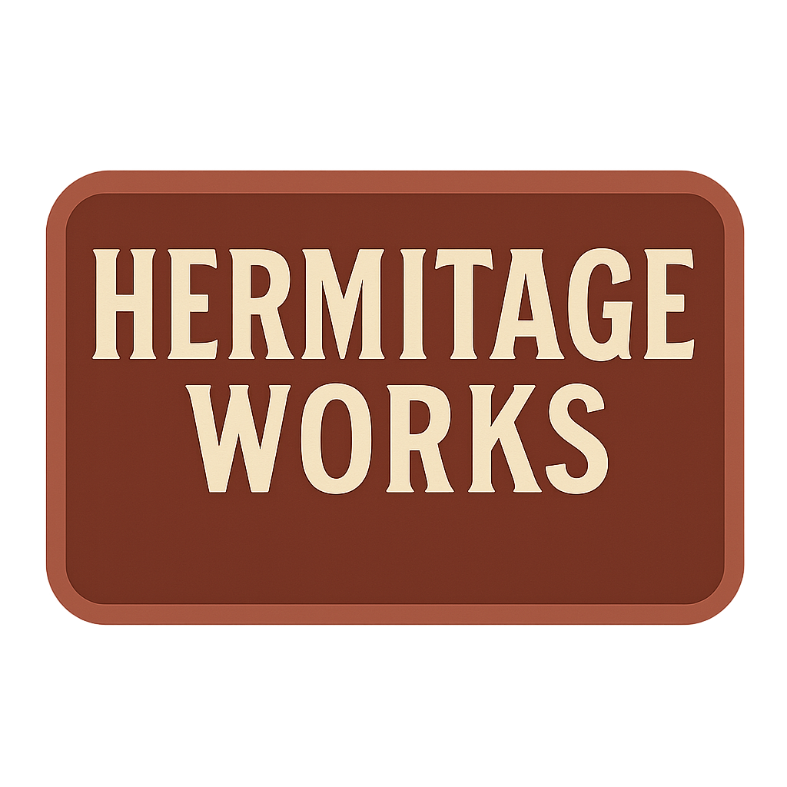
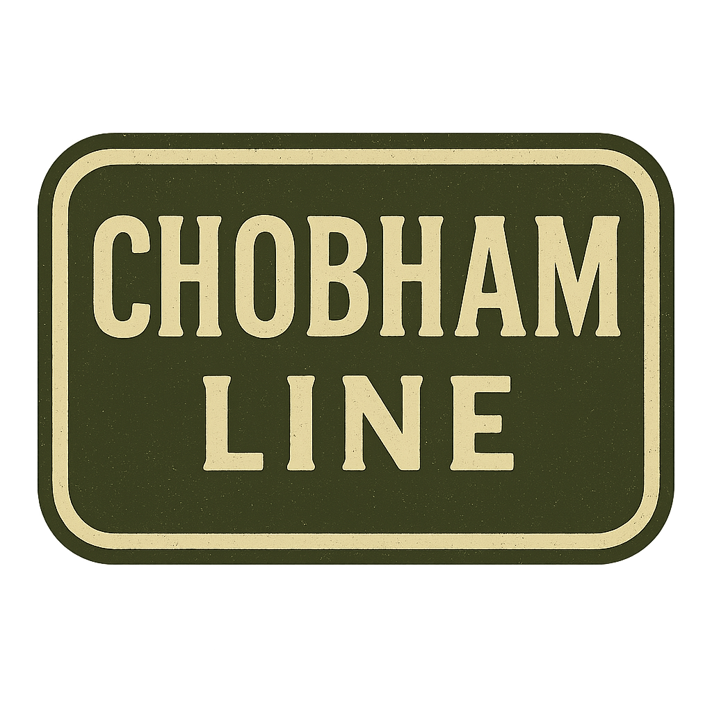

## Company History

[A History of Phillips Brothers of Surrey](History.md)

## Company Branding

[Company Branding Guide](/data/Branding.md)

## Product Catalogue

## Hermitage Line

*Traditional Craftsmanship. Heritage Performance.*

> The Hermitage Line celebrates Phillips Brothers’ roots near Box Hill and Hermitage Farm, offering vintage-styled, small-scale equipment inspired by their earliest post-war designs. Built for smallholders, heritage farms, and estate work, these machines blend nostalgic styling with modern-day usability.

[HM65 “FieldCutter” Hay Mower](Hermitage/HM65-FieldCutter-HayMower.md)

[HT5 “MeadowMaster” Hay Turner (Tedder)](Hermitage/HT5-MeadowMaster-HayTurner.md)

[HR5 “FieldMate” Spiral Hay Rake (Windrower)](Hermitage/HR5-FieldMate-SpiralHayRake.md)

SB-50 "The Surrey Star" Small Square Baler

TH-15 "Hermit" Hay Trailer

## Chobham Series 

*Strength Where It Counts.*

> The Chobham Line is a rugged, utility-focused range from Phillips Brothers, finished in military-inspired olive and graphite. Built for strength and reliability, it’s designed to handle tough farm work with no-nonsense engineering.

PL-2 “Furrowman” Mounted Plough

PL-4 “SuperFurrow” Four-Furrow Mounted Plough

TT-25 "The Barn Runner" Grain & Tipping Trailer

