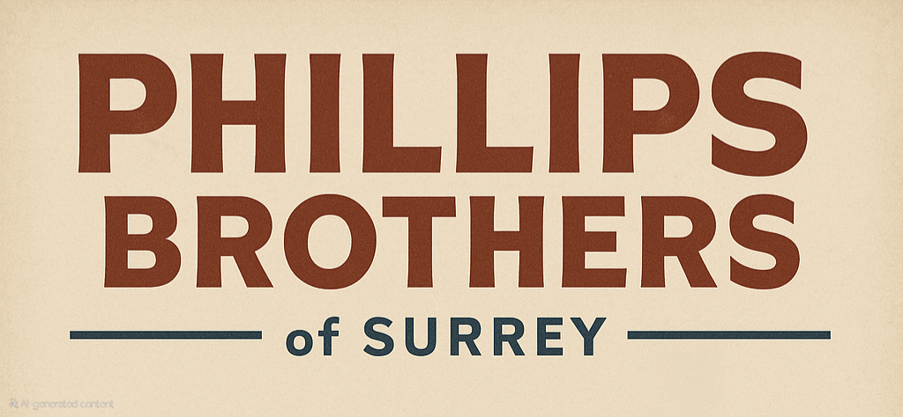
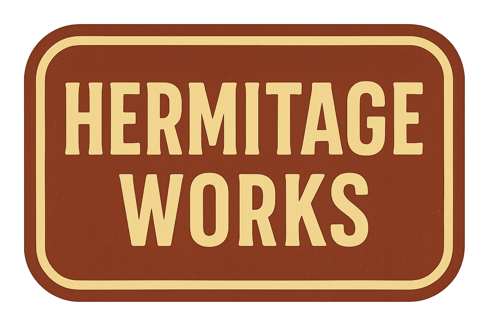

## Company History

[A History of Phillips Brothers of Surrey](History.md)

## Company Branding

[Company Branding Guide](/data/Branding.md)

## Product Catalogue

## Hermitage Works

*Traditional Tools. Modern Work.*
> The Hermitage Works Line offers reliable, small-scale implements designed for hay, grass, and ground care on modern British smallholdings.
> Rooted in post-war craftsmanship, these machines combine classic simplicity with everyday practicality.

[Hermitage Works Launch Poster](Hermitage/LaunchPoster-HermitageWorks.png)

[HM65 “FieldCutter” Hay Mower](Hermitage/HM65-FieldCutter-HayMower.md)

[HT5 “MeadowMaster” Hay Turner (Tedder)](Hermitage/HT5-MeadowMaster-HayTurner.md)

[HR5 “FieldMate” Spiral Hay Rake (Windrower)](Hermitage/HR5-FieldMate-SpiralHayRake.md)

SB-50 "The Surrey Star" Small Square Baler

TH-15 "Hermit" Hay Trailer

## Chobham Line 

*Strength Where It Counts.*
> The Chobham Line is Phillips Brothers’ toughest range yet—built for heavy-duty tasks like ploughing, hauling, and ground preparation.
> With reinforced steel frames and no-nonsense engineering, it’s made to handle the hard graft of the British farm.

PL-2 “Furrowman” Mounted Plough

PL-4 “SuperFurrow” Four-Furrow Mounted Plough

TT-25 "The Barn Runner" Grain & Tipping Trailer

## Brooklands Range

*Compact Power. Built to Last.*
> The Brooklands Range from Phillips Brothers delivers compact, dependable tractors engineered for modern smallholdings and mixed farms.
> Designed in Surrey with robust mechanics and straightforward controls, they’re built to work hard and last long—season after season.

