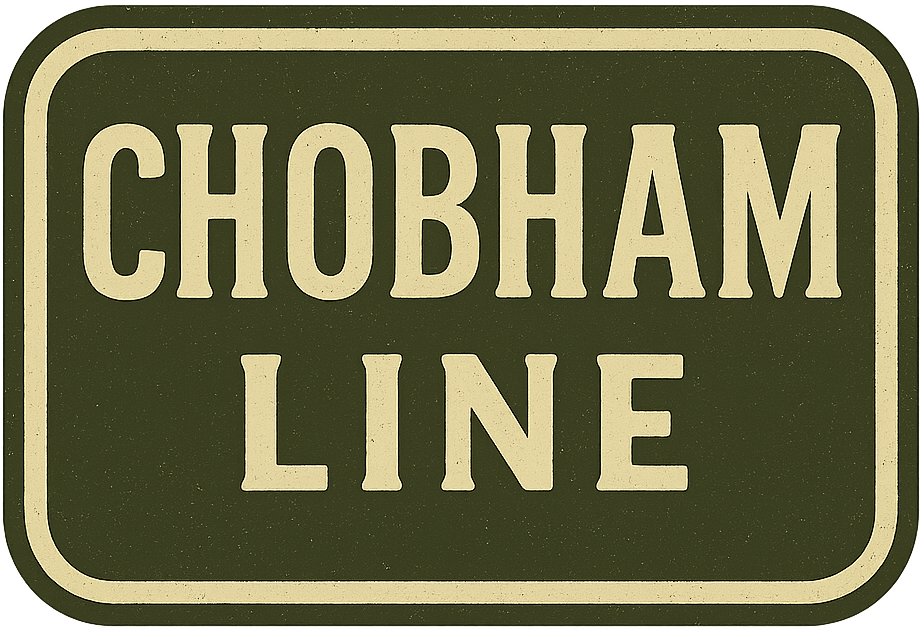

## Company History

[A History of Phillips Brothers of Surrey](History.md)

## Company Branding

[Company Branding Guide](/data/Branding.md)

## Product Catalogue

## Hermitage Works

*Traditional Craftsmanship. Heritage Performance.*

> The Hermitage Line celebrates Phillips Brothers’ roots near Hermitage Farm, offering vintage-styled, small-scale equipment inspired by their earliest post-war designs.
> Built for smallholders, heritage farms, and estate work, these machines blend nostalgic styling with modern-day usability.
> Concentrating on hay making and grassland management.

[Hermitage Works Launch Poster](Hermitage/LaunchPoster-HermitageWorks.png)

[HM65 “FieldCutter” Hay Mower](Hermitage/HM65-FieldCutter-HayMower.md)

[HT5 “MeadowMaster” Hay Turner (Tedder)](Hermitage/HT5-MeadowMaster-HayTurner.md)

[HR5 “FieldMate” Spiral Hay Rake (Windrower)](Hermitage/HR5-FieldMate-SpiralHayRake.md)

SB-50 "The Surrey Star" Small Square Baler

TH-15 "Hermit" Hay Trailer

## Chobham Line 

*Strength Where It Counts.*

> The Chobham Line is a rugged, utility-focused range from Phillips Brothers, finished in military-inspired olive and graphite.
> Built for strength and reliability, it’s designed to handle tough farm work with no-nonsense engineering.

PL-2 “Furrowman” Mounted Plough

PL-4 “SuperFurrow” Four-Furrow Mounted Plough

TT-25 "The Barn Runner" Grain & Tipping Trailer

## Brooklands Range

*Clean lines. Clear purpose. Quiet strength.*

> Inspired by Britain’s legacy of engineering excellence, the Brooklands Range brings a new line of compact, dependable tractors purpose-built for smallholdings and mixed farms.
> Whether it’s towing, tilling, or transport — the Brooklands tractor is engineered to deliver, season after season.

[Brooklands Range Launch Poster](BrooklandsRange/LaunchPoster-BrooklandsRange.png)
