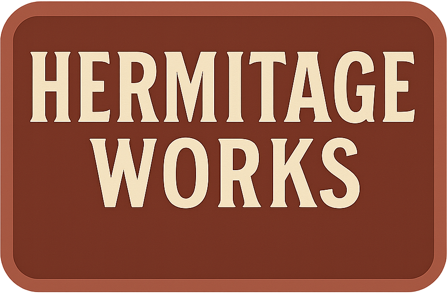

## Catalogue

## Hermitage Line - *Traditional Craftsmanship. Heritage Performance.*

> The Hermitage Line celebrates Phillips Brothers’ roots near Box Hill and Hermitage Farm, offering vintage-styled, small-scale equipment inspired by their earliest post-war designs. Built for smallholders, heritage farms, and estate work, these machines blend nostalgic styling with modern-day usability.

CM-60 “The Hedgerow” Cylinder Mower

HT5 “MeadowMaster” Hay Turner (Tedder)

HW-4 “The Raker” Hay Rake (Windrower)

SB-50 "The Surrey Star" Small Square Baler

TH-15 "Hermit" Hay Trailer

## Chobham Series – *Strength Where It Counts.*

> The Chobham Line is a rugged, utility-focused range from Phillips Brothers, finished in military-inspired olive and graphite. Built for strength and reliability, it’s designed to handle tough farm work with no-nonsense engineering.

PL-2 “Furrowman” Mounted Plough

PL-4 “SuperFurrow” Four-Furrow Mounted Plough

TT-25 "The Barn Runner" Grain & Tipping Trailer
Release Year: 1957
Tractor Requirement: 20–30 HP
Load Capacity: 2000 kg (4,400 lbs) or 2,496 liters
Unladen Weight: 450 kg (990 lbs)
