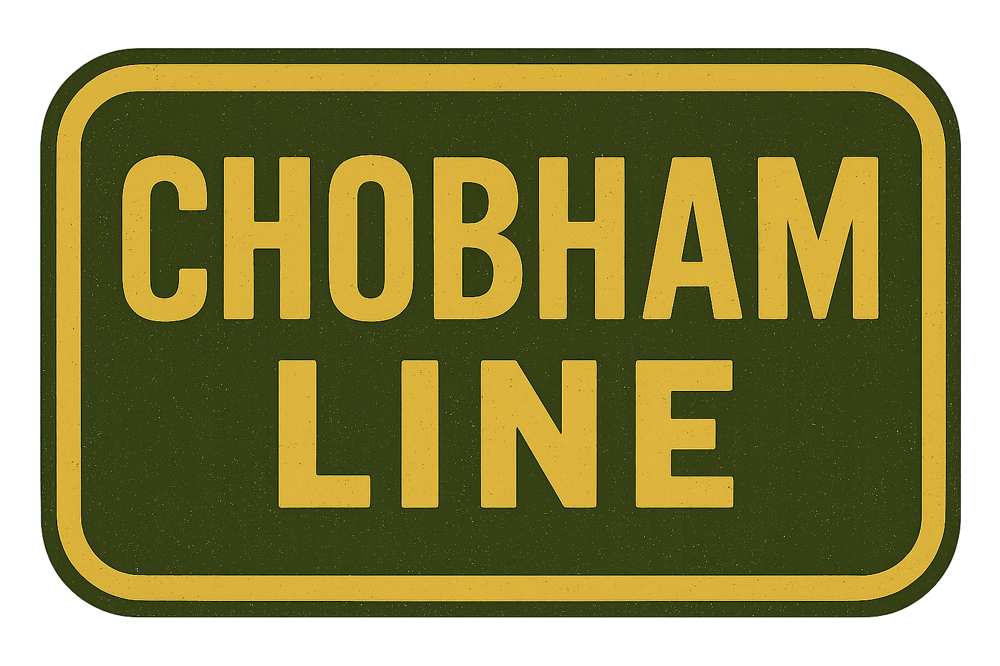
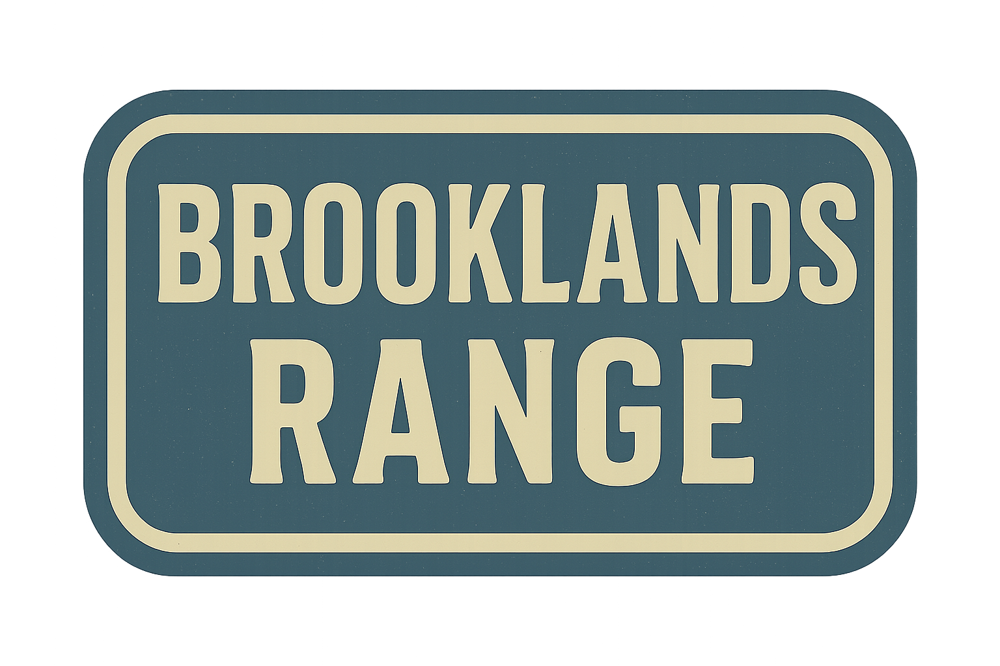

## Company History

[A History of Phillips Brothers of Surrey](History.md)

## Company Branding

[Company Branding Guide](/data/Branding.md)

## Product Catalogue

## Hermitage Works

*Traditional Tools. Modern Work.*

> The Hermitage Works Line offers reliable, small-scale implements designed for hay, grass, and ground care on modern British smallholdings.
> Rooted in post-war craftsmanship, these machines combine classic simplicity with everyday practicality.

[HM65 “FieldCutter” Hay Mower](HermitageWorks/HM65-FieldCutter-HayMower.md)

[HT5 “MeadowMaster” Hay Turner (Tedder)](HermitageWorks/HT5-MeadowMaster-HayTurner.md)

[HR5 “FieldMate” Spiral Hay Rake (Windrower)](HermitageWorks/HR5-FieldMate-SpiralHayRake.md)

SB-50 "The Surrey Star" Small Square Baler

TH-15 "Hermit" Hay Trailer

## Chobham Line 

*Strength Where It Counts.*

> The Chobham Line is Phillips Brothers’ toughest range yet—built for heavy-duty tasks like ploughing, hauling, and ground preparation.
> With reinforced steel frames and no-nonsense engineering, it’s made to handle the hard graft of the British farm.

PL-2 “Furrowman” Mounted Plough

PL-4 “SuperFurrow” Four-Furrow Mounted Plough

TT-25 "The Barn Runner" Grain & Tipping Trailer

## Brooklands Range

*Compact Power. Built to Last.*

> The Brooklands Range from Phillips Brothers delivers compact, dependable tractors engineered for modern smallholdings and mixed farms.
> Designed in Surrey with robust mechanics and straightforward controls, they’re built to work hard and last long—season after season.

BT-20 "FieldStar" Utility Tractor

🛠️ BT-20 "FieldStar" Utility Tractor
Purpose: Versatile light-duty tractor for general farm tasks, towing, and small implements.

Specification	Details
Engine	3-cylinder diesel, naturally aspirated
Horsepower	20 HP
Transmission	6-speed manual (3 forward, 1 reverse, high/low range)
Drive Type	2WD (optional 4WD)
PTO	Rear PTO – 540 RPM
Hydraulics	Single rear hydraulic outlet (open centre)
3-Point Hitch	Category I
Top Speed	15 mph (24 km/h)
Weight	950 kg
Dimensions	2.8 m L × 1.4 m W × 1.8 m H
Livery	Brooklands Blue body, Industrial Brass accents, Hangar Grey chassis

Use Case: Ideal for towing hay rakes, managing small paddocks, or powering vintage-style implements like tedders and seeders.

BT-35 "ClayMaster" Compact Tractor

🛠️ BT-35 "ClayMaster" Compact Tractor
Purpose: Mid-range compact tractor for heavier tasks, cultivation, and year-round duties.

Specification	Details
Engine	4-cylinder diesel, direct injection
Horsepower	35 HP
Transmission	8-speed synchromesh (6F + 2R)
Drive Type	4WD with selectable 2WD mode
PTO	Rear and mid PTO – 540/1000 RPM
Hydraulics	Dual rear hydraulic outlets
3-Point Hitch	Category I
Top Speed	20 mph (32 km/h)
Weight	1,450 kg
Dimensions	3.1 m L × 1.6 m W × 2.0 m H
Livery	Brooklands Blue panels, Industrial Brass trim, Hangar Grey undercarriage

Use Case: Suitable for tillage, baling, orchard mowing, and transport of larger loads on rough terrain.

