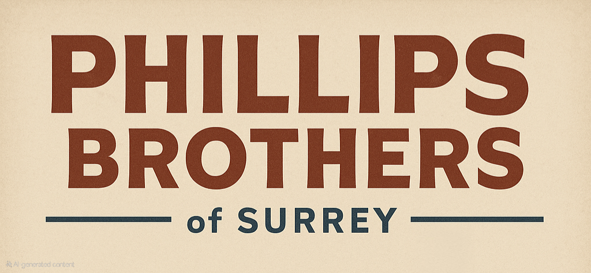
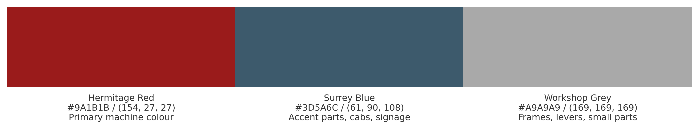
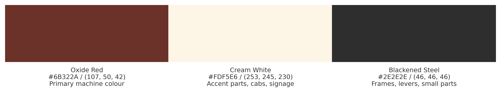
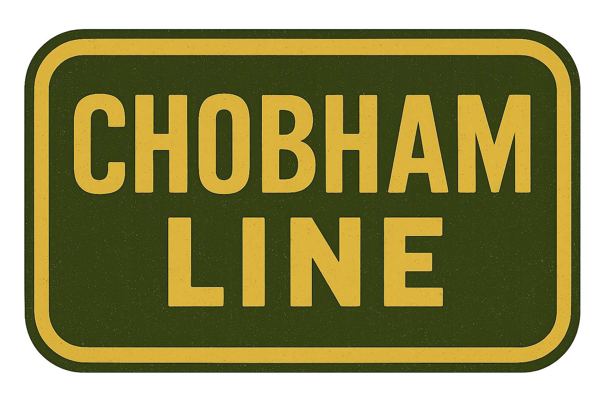
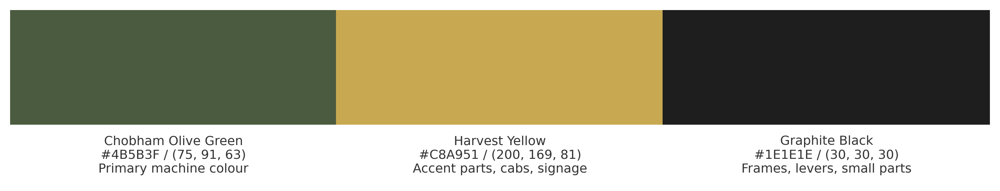
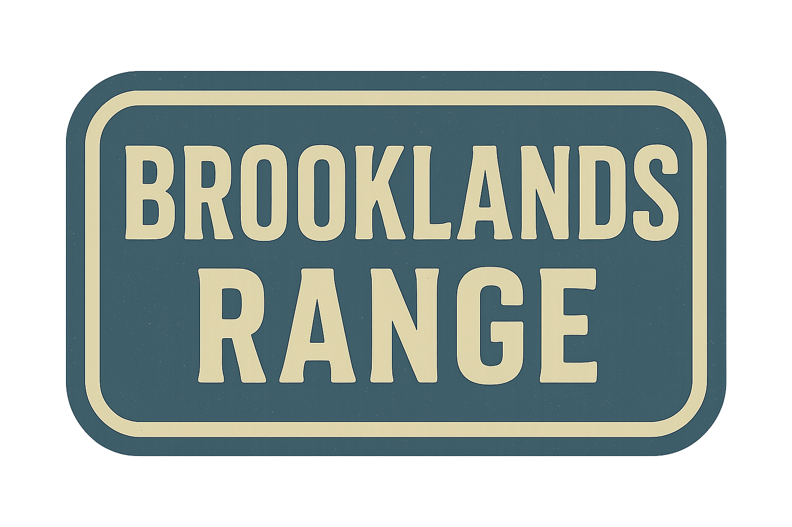
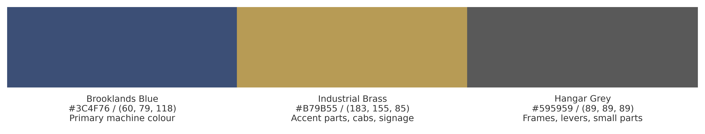

Company Name: Phillips Brothers of Surrey

Established: 1953 - Hermitage Works, Surrey

Brand Ethos:
"Built for Britain. Crafted to Last."
Rooted in Surrey’s farming heartland, Phillips Brothers of Surrey is a symbol of post-war resilience, mechanical honesty, and dependable farm engineering. Established by veterans and craftsmen, the brand continues to stand for legacy, reliability, and honest British work.

 

## Phillips Brothers Main Company Colour Scheme

| Identifier | Colour Name   | Hex     | RGB             | Use                         |
|------------|---------------|---------|-----------------|-----------------------------|
| Primary    | Hermitage Red | #9A1B1B | (154, 27, 27)   | Primary machine colour      |
| Secondary  | Surrey Blue   | #3D5A6C | (61, 90, 108)   | Accent parts, cabs, signage |
| Tertiary   | Workshop Grey | #A9A9A9 | (169, 169, 169) | Frames, levers, small parts |

 

# Product Lines

The company produces the following product lines.

## Hermitage Works
 

Tag line: Crafted at Hermitage. Trusted in the field. Built for seasons to come.

> The Hermitage Works Line offers reliable, small-scale implements designed for hay, grass, and ground care on modern British smallholdings. Rooted in post-war craftsmanship, these machines combine classic simplicity with everyday practicality.

### Hermitage Works Colour Scheme

| Identifier | Colour Name     | Hex     | RGB             | Use                         |
|------------|-----------------|---------|-----------------|-----------------------------|
| Primary    | Oxide Red       | #6B322A | (107, 50, 42)   | Primary machine colour      |
| Secondary  | Cream White     | #FDF5E6 | (253, 245, 230) | Accent parts, cabs, signage |
| Tertiary   | Blackened Steel | #2E2E2E | (46, 46, 46)    | Frames, levers, small parts |

 

## Chobham Line
 

Tag line: Strength Where It Counts.

> The Chobham Line is Phillips Brothers’ toughest range yet—built for heavy-duty tasks like ploughing, hauling, and ground preparation. With reinforced steel frames and no-nonsense engineering, it’s made to handle the hard graft of the British farm.

| Identifier | Colour Name         | Hex     | RGB            | Use                         |
|------------|---------------------|---------|----------------|-----------------------------|
| Primary    | Chobham Olive Green | #4B5B3F | (75, 91, 63)   | Primary machine colour      |
| Secondary  | Harvest Yellow      | #C8A951 | (200, 169, 81) | Accent parts, cabs, signage |
| Tertiary   | Graphite Black      | #1E1E1E | (30, 30, 30)   | Frames, levers, small parts |

 

## Brooklands Range
 

Tag line: Compact Power. Built to Last.

> Inspired by Britain’s legacy of engineering excellence, the Brooklands Range brings a new line of compact, dependable tractors purpose-built for smallholdings and mixed farms.
> Designed at Hermitage Works and tested in the Surrey clay, these tractors combine modern reliability with traditional sensibilities: straightforward controls, robust mechanics, and the trademark no-nonsense build our name stands for.
> Whether it’s towing, tilling, or transport — the Brooklands tractor is engineered to deliver, season after season.

### Brooklands Range Colour Scheme

| Identifier | Colour Name      | Hex     | RGB            | Use                         |
|------------|------------------|---------|----------------|-----------------------------|
| Primary    | Brooklands Blue  | #3C4F76 | (60, 79, 118)  | Primary machine colour      |
| Secondary  | Industrial Brass | #B79B55 | (183, 155, 85) | Accent parts, cabs, signage |
| Tertiary   | Hangar Grey      | #595959 | (89, 89, 89)   | Frames, levers, small parts |

 

# Logo

## Phillips Brothers of Surrey Company Logo

### Typography
The words “PHILLIPS” and “BROTHERS” are in bold, all-uppercase letters with a strong, geometric sans-serif font. The font has a mid-century industrial feel.
The text is colored in Phillips Brothers Primary Colour as defined in the colour scheme.
Below that, the words “of SURREY” are in smaller text. "of" is in lowercase and "SURREY" is uppercase.
The color of "of SURREY" is the Phillips #Brokers Secondary Colour, as defined in the colour scheme, matching the thin horizontal lines on either side.

### Layout
The text is center-aligned.
There are two horizontal lines flanking the "of SURREY" portion, giving it a framed, balanced appearance.

### Background
Transparent background

### Style
Overall, the design evokes a 1950s British agricultural or industrial identity, fitting well with the theme of a classic farm equipment manufacturer.

## Product Line Logos

Each product line should have it's own logo based on the following specifications.

### Size and Shape
The logo should be rectangular, with rounded corners following the border, wider than it is tall, with a ratio of approximately  10 : 7

### Typography
The name of the product line should be split into two, presented one above the other. They are written in bold, all-uppercase letters using a condensed, blocky serif typeface evocative of 1950s British signage or railway/industrial stenciling.
The font is clean but retains a slightly rugged or utilitarian aesthetic, suitable for agricultural branding.

## Border
The design features a thick rounded rectangular border in the same tone as the text, creating a cohesive and framed appearance.

### Colour Scheme
Following the correct colour scheme for the product line. if no specific scheme found then revert to the company standard scheme.
The logo background should be the primary colour.
The text and border should be the secondary colour.

## Style
The image has a worn, screen-printed feel with a slightly speckled texture, enhancing its vintage and industrial character.
Overall, the logo evokes mid-century British utility design, matching the historical tone of 1950s farm equipment branding.

# Product Sales Posters Guidelines

## Purpose
Promote the specified product under it's product line with a visually striking, 1950s-style sales page that captures the attention of British smallholders. It should emphasise the values of the product live (eg tradition, utility, and rugged reliability).

## Product line specific
Some product lines may have specific branding rules which will override these guidelines.

## Visual Style
Layout: A4 portrait format
Design Aesthetic: Mid-century British farm journal advert. Slightly worn edges, printed-on-paper texture, and utilitarian simplicity
Visual Texture: Light grain, halftone or screen-print style speckling

## Colour Palette
Based on the appropriate colour scheme for the product line.
Primary background: Product Line colour scheme secondary colour
Frames/details: Product Line colour scheme Tertiary colour
Use brand accent tones subtly (e.g. for headings or bullets)

## Headline
Large bold serif-style headline (condensed, all caps)

## Hero Image
A photorealistic or illustrated rendering of the product in it's product line livery

Should show the unit clearly—either:
- Standalone with transparent background
- Attached to tractor, mid-operation in British hayfield, with background edges gradually blending into the document background.

Style should mimic 1950s sales imagery—clean, slightly idealised, but functionally accurate

## Specification Table
A bordered, clearly structured chart detailing the mower's key specs that are relevent to the product type.

## Key Features Section
Key features of the product, likely to appeal to farmers, seperate from working specifications (above) 
Bulleted highlights with a mechanical, practical tone.

## Marketing Copy / Body Text
Styled in a slightly persuasive but grounded tone,

## Footer

### Availability/Service Tagline:
“Available through authorised dealers. Parts & service nationwide.”

### Contact Note:
Phillips Brothers of Surrey – Hermitage Works, est. 1953

Optional small print box with dealer/distributor contact details

## Design Notes

- Use 1950s condensed serif fonts for headings
- Use classic grotesque sans-serifs for body text (e.g. Gill Sans-style)
- All text and visual elements should follow the product line logo & colour guidelines from the brand guide
