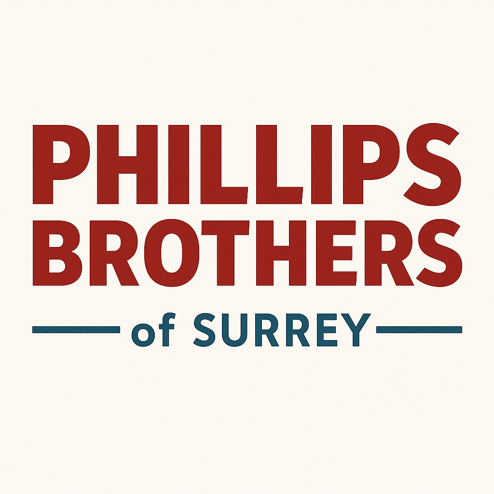
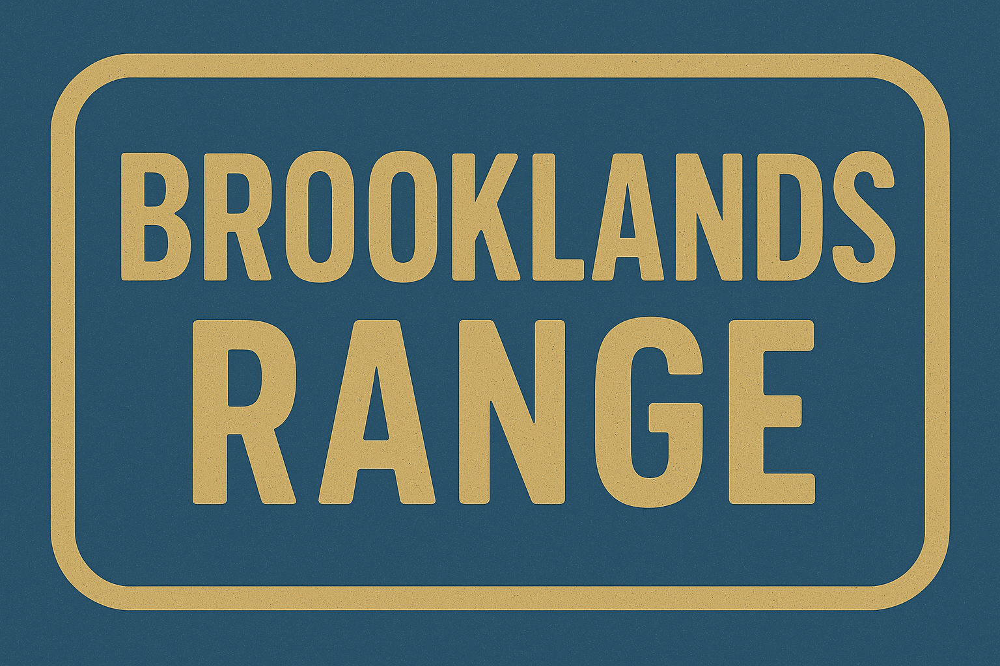

Company Name: Phillips Brothers of Surrey

Established: 1953 - Hermitage Works, Surrey

Brand Ethos:
"Built for Britain. Crafted to Last."
Rooted in Surrey’s farming heartland, Phillips Brothers of Surrey is a symbol of post-war resilience, mechanical honesty, and dependable farm engineering. Established by veterans and craftsmen, the brand continues to stand for legacy, reliability, and honest British work.

 

## Phillips Brothers Main Company Colour Scheme

| Identifier | Colour Name   | Hex     | RGB             | Use                         |
|------------|---------------|---------|-----------------|-----------------------------|
| Primary    | Hermitage Red | #9A1B1B | (154, 27, 27)   | Primary machine colour      |
| Secondary  | Surrey Blue   | #3D5A6C | (61, 90, 108)   | Accent parts, cabs, signage |
| Tertiary   | Workshop Grey | #A9A9A9 | (169, 169, 169) | Frames, levers, small parts |

 

# Product Lines

The company produces the following product lines.

## Hermitage Works
 

### Hermitage Works Colour Scheme

| Identifier | Colour Name     | Hex     | RGB             | Use                         |
|------------|-----------------|---------|-----------------|-----------------------------|
| Primary    | Oxide Red       | #6B322A | (107, 50, 42)   | Primary machine colour      |
| Secondary  | Cream White     | #FDF5E6 | (253, 245, 230) | Accent parts, cabs, signage |
| Tertiary   | Blackened Steel | #2E2E2E | (46, 46, 46)    | Frames, levers, small parts |

 

## Chobham Line
 

| Identifier | Colour Name         | Hex     | RGB            | Use                         |
|------------|---------------------|---------|----------------|-----------------------------|
| Primary    | Chobham Olive Green | #4B5B3F | (75, 91, 63)   | Primary machine colour      |
| Secondary  | Harvest Yellow      | #C8A951 | (200, 169, 81) | Accent parts, cabs, signage |
| Tertiary   | Graphite Black      | #1E1E1E | (30, 30, 30)   | Frames, levers, small parts |

 

## Brooklands Range
 

### Brooklands Range Colour Scheme

| Identifier | Colour Name      | Hex     | RGB            | Use                         |
|------------|------------------|---------|----------------|-----------------------------|
| Primary    | Brooklands Blue  | #3C4F76 | (60, 79, 118)  | Primary machine colour      |
| Secondary  | Industrial Brass | #B79B55 | (183, 155, 85) | Accent parts, cabs, signage |
| Tertiary   | Hangar Grey      | #595959 | (89, 89, 89)   | Frames, levers, small parts |

 

# Logo

## Phillips Brothers of Surrey Company Logo

### Typography
The words “PHILLIPS” and “BROTHERS” are in bold, all-uppercase letters with a strong, geometric sans-serif font. The font has a mid-century industrial feel.
The text is colored in Phillips Brothers Primary Colour as defined in the colour scheme.
Below that, the words “of SURREY” are in smaller text. "of" is in lowercase and "SURREY" is uppercase.
The color of "of SURREY" is the Phillips #Brokers Secondary Colour, as defined in the colour scheme, matching the thin horizontal lines on either side.

### Layout
The text is center-aligned.
There are two horizontal lines flanking the "of SURREY" portion, giving it a framed, balanced appearance.

### Background
Transparent background

### Style
Overall, the design evokes a 1950s British agricultural or industrial identity, fitting well with the theme of a classic farm equipment manufacturer.

## Product Line Logos

Each product line should have it's own logo based on the following specifications.

### Size and Shape
The logo should be rectangular, wider than it is tall, with a ratio of approximately  10 : 7

### Typography
The name of the product line should be split into two, presented one above the other. They are written in bold, all-uppercase letters using a condensed, blocky serif typeface evocative of 1950s British signage or railway/industrial stenciling.
The font is clean but retains a slightly rugged or utilitarian aesthetic, suitable for agricultural branding.

## Border
The design features a thick rounded rectangular border in the same tone as the text, creating a cohesive and framed appearance.

### Colour Scheme
Following the correct colour scheme for the product line. if no specific scheme found then revert to the company standard scheme.
The logo background should be the primary colour.
The text and border should be the secondary colour.

## Style
The image has a worn, screen-printed feel with a slightly speckled texture, enhancing its vintage and industrial character.
Overall, the logo evokes mid-century British utility design, matching the historical tone of 1950s farm equipment branding.

# Sales Posters Guidelines

 
